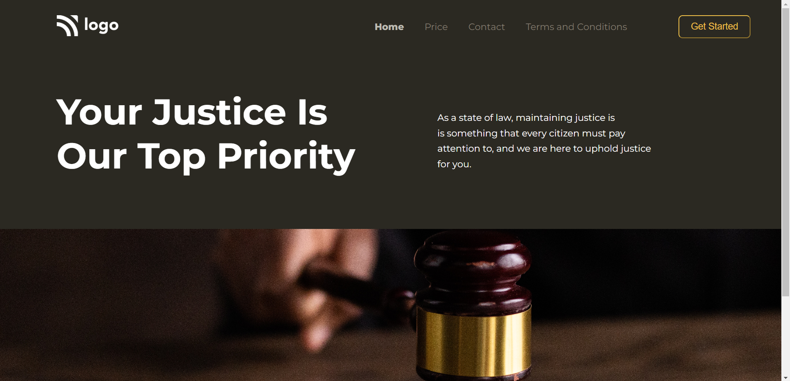

# Project 3

## Project 3 [Live link]()

- Skills Gained in this project 
    - Learned to use **Object-fit & Object-positon** for image.
    

## Time Taken to Complete this project
    -1.5hours Hours taken to Complete it.

### ScreenShot
